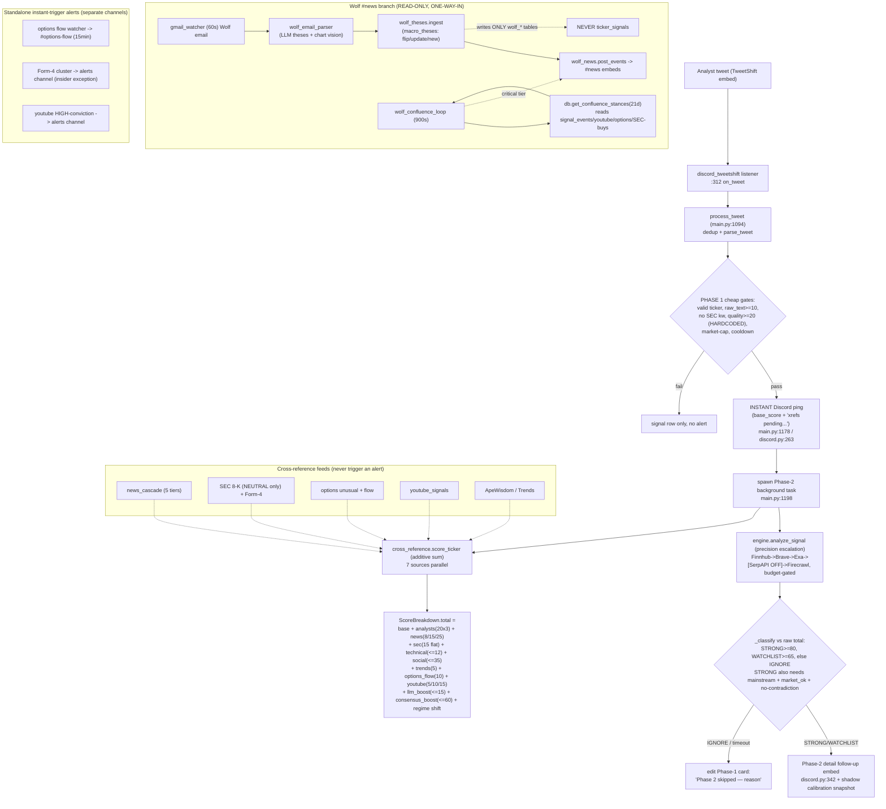

# Pass 0 — System Map (signal-features-2026-06-09)

Faithful map of what EXISTS in the signal-first stock-alert Discord bot, synthesized from six explorer passes over real source. No features are proposed here. Every non-obvious claim cites `file:line`. Claims I re-verified directly against source during synthesis are tagged **[verified]**.

---

## 1. Component inventory

Status legend: **active** = runs in production; **flag-OFF** = wired but a config flag/default keeps it dark; **flag-ON** = wired behind a flag that is set true; **disabled** = explicitly off both in code default and config; **stub** = present but does nothing; **deprecated/dead** = unreachable in production config.

### Scanners (signal sources + cross-reference feeds)

| Module | What it does | Status | Evidence |
|---|---|---|---|
| `scanners/discord_tweetshift.py` | Live WebSocket listener on the TweetShift feed channel; parses each analyst-tweet embed into a tweet dict and calls `on_tweet` (the alert trigger). Also routes `!`-commands + `@`-mentions on other channels behind an atomic `claim_message` gate; replays missed messages on reconnect. | active | `discord_tweetshift.py:70-154` parse; `:312-363` feed→on_tweet; `:401-473` command/mention routing; `main.py:652-653,675` wiring |
| `scanners/social.py::scan_apewisdom` | Free ApeWisdom REST API → trending Reddit-mention tickers, one NEUTRAL signal each. The only social-sentiment source ON in the poll loop. | active | `social.py:178-219`; `consensus.yaml:154` apewisdom_enabled true; `main.py:139-144` |
| `scanners/social.py` Google-Trends family | Search-interest spike per ticker. Poll loop uses the FREE combined path (Pytrends→Exa proxy) because `main.py:27` aliases `scan_google_trends_combined` as `scan_google_trends`. Paid SerpAPI version is cron-only. Pytrends auto-disables in-process after 3 failures/24h with no re-arm. | active | `social.py:517-531,352-434,441-510`; `main.py:27,172-183`; `consensus.yaml:155-156` |
| `scanners/social.py::scan_reddit` | Subreddit-post scan with keyword sentiment. Dark: gated by `social.reddit_enabled`, a key ABSENT from config → defaults False. | disabled | `social.py:47-71`; `main.py:150` default False; no `reddit_enabled` key in config |
| `scanners/social.py::scan_stocktwits` | Playwright scrape of StockTwits trending; every found symbol hardcoded BULLISH. Off in config AND code default. | disabled | `social.py:106-171`; `consensus.yaml:153` false; `main.py:161` default False |
| `scanners/reddit_trend.py` | Separate Reddit pipeline: mention-count / unique-author / momentum metrics over a lookback. NOT in the poll loop — only reachable via a Discord command. | active (command-only) | `reddit_trend.py:108-150`; `commands.py:481`; no `main.py` reference |
| `scanners/news.py::news_cascade` | 5-tier catalyst search (recent-earnings → Finnhub news → Google News RSS → Brave → SearXNG), tiers race when `parallel:true`. Feeds cross-reference, `!all`, Wolf beneficiaries — never triggers a tweet alert itself. Catalyst type is pure substring keyword matching. | active | `news.py:452-529,35-65,340-400`; `consensus.yaml:93-105` |
| `scanners/searxng.py` | Generic web search: self-hosted SearXNG (localhost:8888) → Tavily → Firecrawl fallback. Used as news tier 4 + gap-fill. | active | `searxng.py:37-152`; `news.py:31,403-423` |
| `scanners/options.py` legacy unusual-activity | `check_unusual_options`: scans the SINGLE nearest expiry, flags ≥3×OI / ≥100 vol. Feeds cross-reference scoring + the `!all` "options_unusual" boolean. | active | `options.py:30-132`; `cross_reference.py:315-316`; `aggregator.py:264` |
| `scanners/options.py` #18 FLOW watcher | `scan_options_flow`: nearest 2 expiries, ≥10×OI / ≥500 vol / ≥$250k premium, staleness-gated. The live autonomous alerter posting to #options-flow every ~15 min. | flag-ON | `options.py:171-352`; `consensus.yaml:742` enabled true; `main.py:338-387` |
| `scanners/options.py` max-pain (#6) | `compute_max_pain`: weekly+monthly max-pain strike + put/call OI ratio. `!all` embed field only. | flag-ON | `options.py:361-561`; `consensus.yaml:711-712` enabled true; `aggregator.py:298-299` |
| `scanners/earnings_calendar.py` | Upcoming-earnings pre-alert; next-earnings date; recent-earnings recap (EPS surprise + revenue YoY), returns None in pre-earnings mode (no stale data). | active | `earnings_calendar.py:96-217`; callers `news.py:150-153`, `aggregator.py:244/249`, `catalyst_resolver.py:157` |
| `scanners/earnings_move.py` (#6) | Average ABS % price reaction over last N earnings prints. `!all` embed field. | flag-ON | `earnings_move.py:31-98`; `aggregator.py:308` |
| `scanners/nasdaq_calendar.py` (#13) | NASDAQ public calendar JSON → forward earnings + dividend ex-dates (60d); weekly-options-expiry fallback. | active | `nasdaq_calendar.py:50-185`; `aggregator.py:1138` |
| `scanners/snapshot.py` (#6) | One yfinance `.info` call → analyst targets, rating, fwd P/E, short interest, 52-wk levels. `!all` embed field. | flag-ON | `snapshot.py:66-124`; `aggregator.py:305`; `narrator.py:949-974` |
| `scanners/sec_edgar.py` | SEC EDGAR client: ticker→CIK map, recent filings, Form-4 XML parse, open-market $ math. Feeds per-ticker poll loop, cross-reference, `!all`, commands, Form-4 cluster. | active | `sec_edgar.py:31-338`; `main.py:230`; `aggregator.py:261`; `commands.py:713` |
| `scanners/sec_form4_cluster.py` (D1) | ≥3 insiders each buying >$250k open-market → standalone Discord insider alert (matches alert-philosophy exception). Regime-aware falling-knife gate. | flag-ON | `sec_form4_cluster.py:247-350`; `consensus.yaml:734,126`; `main.py:313-324` |
| `scanners/sec_watcher.py` | Real-time 8-K ATOM feed; whitelists price-moving items {1.01,2.02,5.02,7.01,8.01}. Stores NEUTRAL signal only — 8-K NEVER alerts standalone (code + CLAUDE.md rule). | flag-ON | `sec_watcher.py:119-185`; `main.py:194-220`; `consensus.yaml:126` |
| `scanners/youtube.py` | YouTube RSS poll → v2 two-stage evidence pipeline; fires HIGH-conviction standalone alerts; paced ~1 video/min for Gemini quota. | active | `youtube.py:41-723,1192-1255`; `consensus.yaml:399` enabled true **[verified]** |
| `scanners/gmail_watcher.py` | Wolf newsletter ingester (60s poll, sender + email-auth gates). Writes ONLY to Wolf tables — never `ticker_signals`. | active | `gmail_watcher.py:344-348,5-8`; `consensus.yaml:802` enabled true |

### Analysis (parsers, scorers, gates)

| Module | What it does | Status | Evidence |
|---|---|---|---|
| `analysis/tweet_parser.py::parse_tweet` | Multimodal tweet→ParsedTweet via `models.router` (text+vision). Hybrid conviction (deterministic heuristic overrides model when decisive). | active | `tweet_parser.py:199-234,124-158` |
| `analysis/tweet_parser.py::analyze_tweet_image` | Vision function that fetches the image then returns a hardcoded EMPTY result. ZERO callers. | stub | `tweet_parser.py:272-294` (comment + empty return); no callers |
| `analysis/captions_llm_parser.py` (F1) | Auto-captions → EvidenceBundle via LLM. Spans have NO numbers/dates/visual → captions-only videos yield direction signals only. Second chain tier (after Gemini). | flag-ON | `captions_llm_parser.py:146-249`; `consensus.yaml:484`; `local_video_ingest.py:201` |
| `analysis/gemini_video_parser.py` (F2) | PRIMARY video extractor; the ONLY source of on-screen chart numbers. Multi-key 429 rotation; quarantines NULL-token fabricated recaps. | active | `gemini_video_parser.py:517-635,584-598`; `consensus.yaml:413` |
| `analysis/video_classifier.py` | Deterministic production brain — turns evidence spans into structured candidates in pure Python (no LLM). SHORT requires forward-verb AND non-recap. | active | `video_classifier.py:712-893,306` |
| `analysis/video_parser.py` | LEGACY transcript parser. Reached only when `legacy_fallback=true`, which is FALSE → unreachable dead code. Carries decommissioned Groq model `mixtral-8x7b-32768`. | deprecated/dead | `video_parser.py:858-1030,442`; `consensus.yaml:425` false **[verified]** |
| `analysis/llm_scorer.py` | LLM confidence (0-100) → rescaled to ≤15 pts `llm_boost`; reasoning becomes thesis. | active | `llm_scorer.py:103-158`; `cross_reference.py:535-546`; `consensus.yaml:64` |
| `analysis/calibration.py` | Isotonic/Platt P(up) from outcomes. **Observability only** — never gates the alert. Needs ≥50 rows; `retrain_enabled=false` so always identity. | active (shadow) | `calibration.py:52-72`; `consensus.yaml:377` false **[verified]**; `discord.py:236-257` display-only |
| `analysis/regime.py` | SPY realized-vol regime tag; `threshold_shift` (calm -5 / elevated +5 / panic +10) ADDED to STRONG cutoff. One of two blocks that actually moves the score. | flag-ON | `regime.py:35-72`; `engine.py:247-249`; `consensus.yaml:718-728` **[verified]** |
| `analysis/contradiction.py` (A1) | Penalty downgrade if `contradiction_index ≥ 0.5`. **DEAD: the index is never computed live** (always 0.0). Penalty branch is unreachable. | flag-ON but inert | `contradiction.py:96-116`; only non-deprecated refs are pass-throughs `engine.py:423` + `main.py:1344` `getattr(...,0.0)` **[verified]** |
| `analysis/herding.py` (A2) | Analyst-cluster detector → writes cluster rows + log. Called with `new_event_id=0`. Adds ZERO points to the score. | flag-ON (observability) | `herding.py:58-230`; `main.py:1156-1161`; no ScoreBreakdown wiring |
| `analysis/consolidation.py` (A3) | Bayesian cross-source fusion → `consensus_boost` (cap ~60). One of two blocks that actually moves the score. Cold-start forces 0. | flag-ON | `consolidation.py:48-205`; `cross_reference.py:548-561` |
| `analysis/ticker_grounding.py` | Verifies an LLM ticker label is literally in evidence text; builds video allowlist. | active | `ticker_grounding.py:63-167` |
| `analysis/hallucination_grounding.py` (F3) | Thin grounding wrapper for Whisper transcripts. | active | `hallucination_grounding.py:22-42` |
| `analysis/catalyst_resolver.py` | Resolves relative date phrases; verifies EARNINGS catalysts vs Finnhub calendar. Macro catalysts always `verified=0` (no source wired). | active | `catalyst_resolver.py:179-196` |
| `analysis/peer_comparison.py` | Relative-strength vs curated peers. Display/narrator only — does NOT feed the score. | flag-ON (display) | `peer_comparison.py:180-259`; `aggregator.py:302` |
| `analysis/sector_confirmation.py` (A4) | Sector-ETF direction check → can set `skip_market_gate`. Cannot block; only contributes to a bypass OR-clause. | flag-ON | `sector_confirmation.py:172-294`; `engine.py:407-417` |
| `analysis/level_display_sanity.py` | DROP a level ≥2× / ≤0.5× live price (display-time). Built after NVDA-850-on-$208 reached users. | active | `level_display_sanity.py:68-126`; `_MAX_RATIO=2.0` line 31 |
| `analysis/price_sanity.py` | Alert-time level plausibility on YouTube-save path; allows split-factor ratios but EXCLUDES 5× (NVDA-850 class). | active | `price_sanity.py:71-101`; `_SPLIT_FACTORS:21-32` |
| `analysis/spot_policy.py` | Single source of truth for "spot price None/≤0" handling (DEMOTE vs HARD_REJECT). | active | `spot_policy.py:40-67` |
| `analysis/calendar_filter.py` | Rejects 4-digit year mis-extracted as a price in calendar context. | active | `calendar_filter.py:51-85` |
| `analysis/technical.py::verify_technical` | 6-filter pass/fail engine (RVOL, VWAP, RSI, EMA cross, change%, ATR breakout). Cross-reference gate + `!all` source. | active | `technical.py:89-311`; `cross_reference.py:266`; `aggregator.py:143-146` |
| `analysis/indicators.py` | Pure-math indicators (ema/sma/rsi/atr/vwap/rvol/crossover/pct). No I/O. | active | `indicators.py:10-159` |
| `analysis/patterns.py` | 3 bullish-only chart patterns (breakout / bull-flag / double-bottom); grounds `!all` narrative with a price level. | active | `patterns.py:27-194`; `aggregator.py:254,505` |

### Wolf newsletter brain (analysis/wolf_* + alerts/wolf_*)

| Module | What it does | Status | Evidence |
|---|---|---|---|
| `analysis/wolf_email_parser.py` | One Wolf email → validated extraction (LLM theses, clamps, inverse-ETF flip, quote-substring anti-fabrication, chart-level merge). | active | `wolf_email_parser.py:371,165-312,413-448` |
| `analysis/wolf_scope.py` | Canonical (scope_type, scope_key) mapping; inverse-proxy flag; forward proxy symbol for outcomes. | active | `wolf_scope.py:96-186` |
| `analysis/wolf_conviction.py` | Pure conviction math. Score 0-100 is DISPLAY-ONLY. Alert fires only on STRUCTURAL escalation. | active | `wolf_conviction.py:106-186` |
| `analysis/wolf_theses.py` | Stateful `macro_theses` tracker (flip/update/new, sprawl caps, idempotent). Emits new / conviction_update events. | active | `wolf_theses.py:159-261,58-91` |
| `analysis/wolf_confluence.py` | Cross-source scoring — reads the live engine's 4 source tables, one net vote each (≥60% dominance), tiers surface/high/critical. Can only push tier UP. | active | `wolf_confluence.py:200,146-268,190-197` |
| `analysis/wolf_beneficiaries.py` (#2) | Bot's OWN ranked beneficiary longs/shorts per macro thesis (RS + catalyst/flow lift). | active | `wolf_beneficiaries.py:257-430`; `consensus.yaml:888,902` |
| `analysis/wolf_outcomes.py` | Sunday recap: did acting calls move his way? Proxy-price move, vol dead-band. NO benchmark adjustment. | active | `wolf_outcomes.py:91,28-89` |
| `analysis/wolf_vision.py` | Chart-image reader (SSRF-guarded, rotating model pool). Single PAID model (gemini-2.5-flash-lite); free vision all 429. | flag-ON | `wolf_vision.py:270,65-259`; `consensus.yaml:839,851` |
| `alerts/wolf_news.py` | #news poster — durable outbox, clean embeds from validated fields, critical-tier @-ping opt-in. | active | `wolf_news.py:687-798` |
| `alerts/wolf_digest.py` | Midday / nightly / Sunday #news digest scheduler (PT windows). | active | `wolf_digest.py:167-234`; `consensus.yaml:882-885` |
| `db.get_confluence_stances` | The single read-only bridge: reads signal_events / youtube_signals / options_flow / SEC-buys-only and feeds confluence. | active | `db.py:3354-3405` |
| `aggregator._wolf_confluence_lookup` | The ONLY reverse path (Wolf → live `!all`). Flag-OFF. | flag-OFF | `aggregator.py:187-225`; `consensus.yaml:591` false **[verified]** |

### Pipeline / alert formation

| Module | What it does | Status | Evidence |
|---|---|---|---|
| `main.py::process_tweet` | Phase-1 instant-alert entry: dedup, cheap quality gate, market-cap, cooldown → instant ping → spawn Phase-2 task. | active | `main.py:1094-1208` |
| `main.py::_run_cross_reference_and_followup` | Phase-2: parallel `cross_reference()` + `analyze_signal()`; surfaces every skip on the Phase-1 card. | active | `main.py:1211-1375` |
| `cross_reference.py::score_ticker` | Additive base-score builder — 7 sources in parallel, sums into ScoreBreakdown. | active | `cross_reference.py:451-593` |
| `engine.py::analyze_signal` | SEPARATE precision/escalation scorer (cheap→expensive, budget-gated); `_classify` decides STRONG/WATCHLIST/IGNORE. | active | `engine.py:284-445,228-277` |
| `engine.py::BudgetManager` | Atomic per-day API spend caps; over-budget → skip paid source. | active | `engine.py:52-154`; `consensus.yaml:613-622` **[verified]** |
| `alerts/discord.py` | Two-phase Discord delivery + embed formatting; `allowed_mentions {parse:[]}` so the bot can never ping. | active | `discord.py:263-525,28-38` |
| `alerts/commands.py` | Bang-command router (`!all`, `!ask`, `!sec`, `!options`, `!yt`, ~30 cmds). Read-on-demand path. | active | `commands.py:202-313` |
| `alerts/all_command/aggregator.py` | `!all` ~28-way parallel gather + compute orchestrator; 15-min single-flight cache. | active | `aggregator.py:227-417,1384-1462` |
| `alerts/all_command/narrator.py` | `!all` LLM synthesis (Groq head-start chain); separate sanitize chain; data-only fallback. | active | `narrator.py:1143-1232,1076` |

---

## 2. Data sources in use

| Source | Cost | Currently on? | Used for |
|---|---|---|---|
| Discord / TweetShift analyst-tweet embeds | free | ON | Primary live signal feed (Phase-1 trigger) |
| ApeWisdom REST | free | ON | Reddit-mention trending (cross-ref signal) |
| Reddit OAuth/RSS (`scan_reddit`) | free | OFF (key absent → default False) | — |
| Reddit (`reddit_trend.py`) | free | command-only | Discord command, NOT pipeline |
| StockTwits trending (Playwright) | free | OFF (config + code default) | — |
| Google Trends — Pytrends → Exa proxy | free → paid key | ON (free path) | Search-interest signal |
| Google Trends — SerpAPI | paid (3 keys) | cron-only | Daily trends job, not poll loop |
| Finnhub `/quote`, `/company-news`, `/calendar/earnings`, `/stock/earnings` | free tier | ON | Real-time price, technical, news tier, earnings recap, catalyst verify |
| Yahoo chart endpoint (query1) | free (direct HTTP) | ON | 1mo/3mo OHLCV for technical + patterns; regime SPY; falling-knife gate |
| yfinance | free (unofficial) | ON | Option chains, max-pain, earnings-move, snapshot, peer RS, Wolf outcomes |
| Google News RSS | free | ON | News cascade tier 3 |
| Brave Search | free tier (50/day budget + 402 breaker) | ON | News cascade tier 4 / precision Phase 2 |
| SearXNG (localhost:8888) → Tavily → Firecrawl | free → paid fallbacks | ON | News cascade tier 5 / gap-fill |
| Exa AI | paid key | ON (trends fallback + precision Phase 3) | Article-count proxy / mid-cost search |
| SerpAPI (precision Phase 4) | paid | OFF (`serpapi_enabled: false` :612) | dead path despite 3 keys wired **[verified]** |
| Firecrawl (precision Phase 5) | paid credits | ON (only at score ≥65) | Deep page extraction |
| SEC EDGAR (submissions, Form-4 XML, getcurrent ATOM) | free (needs User-Agent) | ON | Insider + 8-K cross-ref; Form-4 cluster alert |
| YouTube Atom RSS | free | ON | Video discovery |
| Google Gemini (video) | free tier (~3-4 videos/key/day) | ON | PRIMARY video extraction + on-screen chart numbers |
| Supadata | paid | ON | Managed caption fetch (sidesteps VPS IP block) |
| Groq (`llama-3.3-70b-versatile`) | free/paid (~100k tok/day) | ON | `!all` narrator synthesis |
| OpenRouter LLM chains | paid/free mix | ON | Scorer, narrator fallbacks, thesis extraction, agent |
| OpenRouter vision (Wolf charts) | paid (`gemini-2.5-flash-lite`) | ON | Wolf chart-image reading (free vision all 429) |
| Gmail API (Wolf newsletter) | free (OAuth) | ON | Sole macro-brain source |
| SQLite `decision_snapshots` outcomes | internal | accumulating only | Would-be calibration labels (retrain OFF) |

---

## 3. Pipeline / data flow

**Plain-English flow:** A watched analyst tweets a ticker → a few cheap local checks → an instant Discord card goes up immediately (signal-first; nothing slow blocks it). In the background, two independent scorers run: an additive sum (cross_reference) and a precision escalation engine. If the precision engine says IGNORE or work times out, the original card is edited to say why; otherwise a detail card is posted underneath. SEC 8-Ks never alert on their own — they only add points. The Wolf newsletter is a fully separate brain that posts to #news and only READS the live tables to corroborate; it never writes back into the per-ticker scoring.

---

## 4. Scoring & gating knobs (verified line numbers in `config/consensus.yaml`)

| Knob | Value | Line | Note |
|---|---|---|---|
| `alerts.cooldown_hours` | 6 | 360 **[verified]** | Blanket fallback; per-analyst scaling is the live path (floor 30 min, max 24h, high-conviction bypass) lines 366-370 |
| `alerts.min_base_score_for_alert` | 20 | 363 **[verified]** | **Knob is inert** — the gate hardcodes `quality_score >= 20` at `main.py:1066` and never reads this key **[verified]** |
| `alerts.suppress_when_degraded` | false | 365 **[verified]** | DEGRADED_MODE high-conf suppressor OFF |
| `precision_engine.serpapi_enabled` | false | 612 **[verified]** | SerpAPI Phase-4 + `!all` Trends both dead despite 3 keys |
| `calibration.retrain_enabled` | false | 377 **[verified]** | Calibrated conf always = raw score/100 |
| **precision_engine.budget** (613-624) **[verified]** | | | |
| `finnhub_calls` | 3000 | 614 | |
| `brave_queries` | 200 | 615 | |
| `exa_queries` | 100 | 616 | |
| `serpapi_queries` | 25 | 617 | |
| `firecrawl_credits` | 10 | 618 | |
| `gemini_input_tokens` | 2,000,000 | 619 | |
| `gemini_output_tokens` | 500,000 | 620 | |
| `gemini_video_calls` | 100 | 621 | |
| `wolf_vision_calls` | 250 | 622 | runaway guard (per-email cap removed 2026-06-09) |
| **precision thresholds** (626-635) **[verified]** | | | |
| `high_confidence` | 80 | 626 | STRONG cutoff |
| `medium_confidence` | 65 | 627 | WATCHLIST cutoff |
| `require_mainstream_for_strong` | true | 632 | STRONG needs a mainstream source |
| `require_market_confirmation_for_low_conviction` | true | 633 | |
| `high_conviction_threshold` | 30 | 634 | base_score ≥30 → bypasses cooldown + market gate |
| `sec_catalyst_exempt` | true | 635 | |
| **regime_classifier** (718-728) **[verified]** | | | NOTE: block is at 718-728, not 716 (one explorer said 716) |
| `regime_shifts` calm/elevated/panic | -5 / +5 / +10 | 720-723 | ADDED to STRONG cutoff (`engine.py:247-249`) |
| `panic_z` / `elevated_z` / `calm_z` | 1.5 / 0.5 / -1.0 | 724-726 | |
| `ema_alpha` | 0.4 | 727 | |
| `cold_start_min_days` | 30 | 728 | identity until 30 regime_daily rows |
| **scoring block** (47-90) | | | additional_analyst 20 (×3 max=60); news_catalyst tiers 25/15/8; sec_filing 15; social 10/10/10; google_trends 5; technical 2/filter cap 12; llm_boost cap 15; options_flow 10; consensus_boost cap 60 |
| **reliability block** | **ABSENT** | — | No `reliability:` YAML block exists. `CrossReferenceResult.reliability_*` fields exist but are never populated — see Gaps. **[verified: no `reliability*.py`]** |

---

## 5. Strengths (specific, with modules)

1. **Signal-first design is real and verified end-to-end.** The instant ping fires before any web call, AI call, or price confirmation; cross-reference + precision run AFTER as a background task. `main.py:1178` (ping) precedes `main.py:1198` (Phase-2 spawn).
2. **Graceful degradation everywhere on the fan-out paths.** `!all` gathers ~28 sources with `return_exceptions=True` so one failure degrades, never crashes (`aggregator.py:340`); narrator falls back to a deterministic data-only embed on any LLM failure (`narrator.py`); searxng has a 3-stage fallback (`searxng.py:37-152`).
3. **Cost control is structural, not ad-hoc.** `BudgetManager.consume` is an atomic conditional SQL update; over-budget simply skips the paid source. This is exactly why the precision engine escalates cheap→expensive (`engine.py:52-154`).
4. **Strong anti-fabrication layering on price levels.** Three independent gates — `calendar_filter` (year-as-price), `price_sanity` (split-factor band, 5× excluded), `level_display_sanity` (2×/0.5× display gate) — were each built in response to real incidents (NVDA-850, SMH-12616, MSFT-$2024).
5. **Wolf brain isolation is clean and deliberate.** `gmail_watcher` writes ONLY to `wolf_*` tables (`gmail_watcher.py:5-8`), so macro newsletter commentary can never contaminate per-ticker scoring; confluence is strictly read-only via the single `db.get_confluence_stances` bridge.
6. **"Silence is failure" is enforced.** Every Phase-2 skip (timeout, IGNORE) edits the original card with a reason (`main.py:1259-1264`) rather than going quiet.
7. **Gemini fabrication defenses.** Per-key 429 rotation distinguishing per-minute vs per-day quota, and a quarantine of spans-with-NULL-token-count (the recap-hallucination signature) at `gemini_video_parser.py:584-598`.

---

## 6. Gaps (verified absent or weak — source-confirmed)

**HIGH severity**

1. **`contradiction_index` has no live producer — the A1 penalty can never fire. [verified]** The only non-deprecated references are pass-throughs: `engine.py:423` forwards the param, `main.py:1344` reads it with `getattr(..., 0.0)`. The actual computation lives only in `_deprecated/regime_detector.py:87`. Since the penalty needs index ≥0.5 and it is always 0.0, the STRONG→WATCHLIST contradiction downgrade is unreachable.
2. **No `reliability_engine.py` exists; reliability display path is dead. [verified]** `find consensus_engine -name 'reliability*.py'` returns nothing. `CrossReferenceResult.reliability_decision`/`reliability_weights` default to `''`/`{}` and are never set, but `alerts/discord.py:224,402-414` branch on them — that whole verdict/freshness render path is dead. (Memory `project_signal_engine_audit` flagged this; still absent.)

**MEDIUM severity**

3. **Two unreconciled scoring systems.** The additive `cross_reference` sum and the `engine` precision escalation are computed from different inputs and never merged. The follow-up shows both a headline xref "Score" and a separate "Precision Engine score" that can disagree (`discord.py:398` vs `:445`); precision class decides whether the follow-up sends, but the number the user reads is the unreconciled xref sum (`main.py:1269-1273`).
4. **`min_base_score_for_alert` YAML knob is inert. [verified]** The instant-alert gate hardcodes `quality_score >= 20` at `main.py:1066`; editing line 363 changes nothing.
5. **Herding (A2) adds zero points.** `detect_cluster` is called with `new_event_id=0` (`main.py:1156`) and `ClusterResult` is never wired into `ScoreBreakdown` — the swarm signal is observability-only despite the flag being ON.
6. **Calibration never gates.** Trained P(up) is computed only for shadow logging + a "Calibrated conf" field; the STRONG/WATCHLIST/IGNORE decision uses the raw additive total. With `retrain_enabled=false` it's always uncalibrated anyway.
7. **8-K body never read.** Item codes are whitelisted but the actual material-event text is never fetched; only `{form, company, url}` stored as NEUTRAL (`sec_watcher.py:107-114`, `main.py:215-220`). The reason the 8-K moves price never reaches the thesis.
8. **Captions-only videos degrade silently to direction-only.** On a Gemini-quota-exhausted day, the F1 fallback emits spans with no numbers/dates/visual, so the classifier produces no levels/setups/catalysts (`captions_llm_parser.py:146-150`; `video_classifier.py:740,551`).
9. **SHORT signals are structurally hard to emit** from YouTube — classifier requires forward-verb AND non-recap AND bear>bull (`video_classifier.py:306`); a plain bearish statement is downgraded to NEUTRAL then suppressed.
10. **Tweet de-dup can drop distinct tweets.** Missing-embed-URL tweets fall back to a synthetic `.../status/unknown`; two such tweets collide and the second is dropped as already-seen (`discord_tweetshift.py:115`; `main.py:1109`).
11. **Catalyst classification is substring-only** (`news.py:35-65`); a synonym outside the 19 hardcoded pattern lists yields no catalyst_type, so the tier returns None even with a real catalyst.
12. **Two options code paths with different coverage** — legacy unusual scans 1 expiry (3×/100), flow watcher scans 2 (10×/500/$250k). Large flow on a further expiry is invisible to the legacy/cross-reference path (`options.py:102-105` vs `:279`).
13. **Wolf confluence vote ignores recency and size.** A 20-day-old tweet counts the same as today's; a $5M sweep counts the same as one contract (`wolf_confluence.py:146-163`).
14. **Wolf outcome scoring has no benchmark.** A relative-strength call is credited "moved_with" if the proxy merely rose, even if it lagged the S&P (`wolf_outcomes.py:144-146`).

**LOW severity**

15. **`analyze_tweet_image` is a dead stub** — fetches the image, returns a hardcoded empty dict, zero callers (`tweet_parser.py:285-290`).
16. **Legacy `video_parser.py` is dead** (`legacy_fallback=false` **[verified]**) yet still carries a decommissioned Groq model default and reads model names at import time — a latent failure if ever re-enabled.
17. **Pytrends auto-disable never re-arms** — mutates in-memory config off for the process with no scheduled re-enable (`social.py:375-378`).
18. **SEC scoring is flat +15** regardless of dollar value or buy/sell; the dollar floors apply only in the autonomous poll loop, not in Phase-2 (`cross_reference.py:485`).
19. **Sanity-gate threshold overlap** — `price_sanity` (split-factor band incl 4×, blocks 5×) vs `level_display_sanity` (flat 2×/0.5×): a level can pass one path and fail the other.
20. **Wolf chart vision has no fallback model** — single paid `gemini-2.5-flash-lite`, `paid_fallback_model` empty; if it's down, chart levels silently vanish (`wolf_vision.py:167`; `consensus.yaml:851-852`).

**Inferred but NOT verified** (flagged per the rules): the claim that the precision-engine and xref "headline" disagreement actually surfaces a confusing number to users rests on reading `discord.py` formatting + `main.py:1269-1273` (read by the explorer); I confirmed the two-scorer structure but did not render a live alert to observe the exact user-facing wording. The `VWAP-from-daily-closes` misnaming (`technical.py:127`) and the `scoring block` line-range 47-90 are reported by explorers and not independently re-read in this pass.

---

## 7. Under-leveraged data (audit seed for STEP 1)

Data the bot already PULLS but extracts little signal from. This is the skeptical-audit seed.

1. **YouTube per-mention direction/recency/trust/confluence (#9-#12) are ALL flag-OFF.** A YouTube mention contributes a flat unsigned +5/+10/+15 — a BEARISH YouTube consensus currently RAISES the score instead of lowering it. Rich direction/trust/recency data is pulled and ignored (`cross_reference.py:383-520`; `consensus.yaml:744-754`).
2. **Analyst quality is ignored in the main score.** `additional_analyst` pays a flat +20 (×3) regardless of `rolling_accuracy`; a high-accuracy and zero-accuracy analyst weigh identically. Accuracy is used only as a trust floor in herding / priors in consolidation, neither of which moves the headline number (`models.py` ScoreBreakdown; `herding.py`).
3. **Consolidation's Bayesian `combined_log_odds` is discarded for scoring** — only the crude `consensus_boost = effective_n × 20` (cap 60) is added; the calibrated log-odds is logged to shadow only (`consolidation.py`).
4. **Options ratios discarded.** `max_call_ratio` / `max_put_ratio` / `put_call_ratio` are computed but only the `has_unusual_activity` boolean reaches scoring (`aggregator.py:865-867`). Max-pain `total_oi` and distance-from-spot are computed then dropped from the embed (`embed.py:345-377`).
5. **Snapshot fundamentals discarded.** `target_high/low`, `n_analysts`, `rating`, `fwd_pe`, `wk52_low_pct` are all computed in `fetch_ticker_snapshot` (`snapshot.py:96-114`) but the narrator feeds only short-interest (when elevated) and `wk52_high_pct` (`narrator.py:957-974`).
6. **Earnings recap magnitude unused.** `eps_surprise_pct` and `revenue_yoy_pct` are computed (`earnings_calendar.py:164-171`) but only shown as text — never a beat/miss scoring factor.
7. **Daily candle volume unused in pattern detection.** Volume is parsed into every candle (`patterns.py:64-67`) but none of the 3 detectors use it — breakouts/flags are confirmed on price only, no volume confirmation.
8. **Regime z-score under-used.** The rich realized-vol z-score only nudges one threshold by ±5-10; it is not surfaced per-alert as risk context or used to scale horizon/position.
9. **8-K item codes + Form-4 role discarded for weighting.** Item code (earnings vs officer change vs material agreement) never weights scoring; a CEO buy and a minor-director buy score identically in the poll loop (`sec_watcher.py:105`; `sec_edgar.py:253-268`).
10. **Gemini `segments` and out-of-band `visual_evidence` dropped.** Per-segment titles are persisted but never used; chart numbers outside the ±10% live-price band (fib extensions, targets) are discarded rather than kept as lower-confidence context (`gemini_video_parser.py:381-388`; `video_classifier.py:870`).
11. **Wolf confluence: SEC buys-only + unweighted votes.** Insider dollar value, number of distinct insiders, and options premium size are all available upstream but each source casts only ONE binary vote; SEC can never vote bear. YouTube `n_channels` is display-only.
12. **Wolf `big_catalysts`, `regime`, chart `indicators/patterns`, and `conviction_phrase` strength** are all extracted/validated/stored then never surfaced in any #news embed or used to bias scoring (`wolf_email_parser.py:450-452`; ChartRead fields).
13. **Decision snapshots + 1h/24h outcomes accumulate but are never fed back** — `retrain_enabled=false` means the labelled outcome data trains nothing and never reaches per-analyst weighting.
14. **Sector-confirmation magnitude unused.** The actual `sector_change_pct` is stored in the feature vector but only used as a binary aligned/blocked bypass flag — never graduated into points.
15. **ApeWisdom / reddit_trend momentum unused in scoring.** ApeWisdom mention count is stored as text on a NEUTRAL signal; reddit_trend momentum (mentions/hour) + unique_authors feed only a Discord command, never scoring (`social.py:205`; `reddit_trend.py:49-75`).
