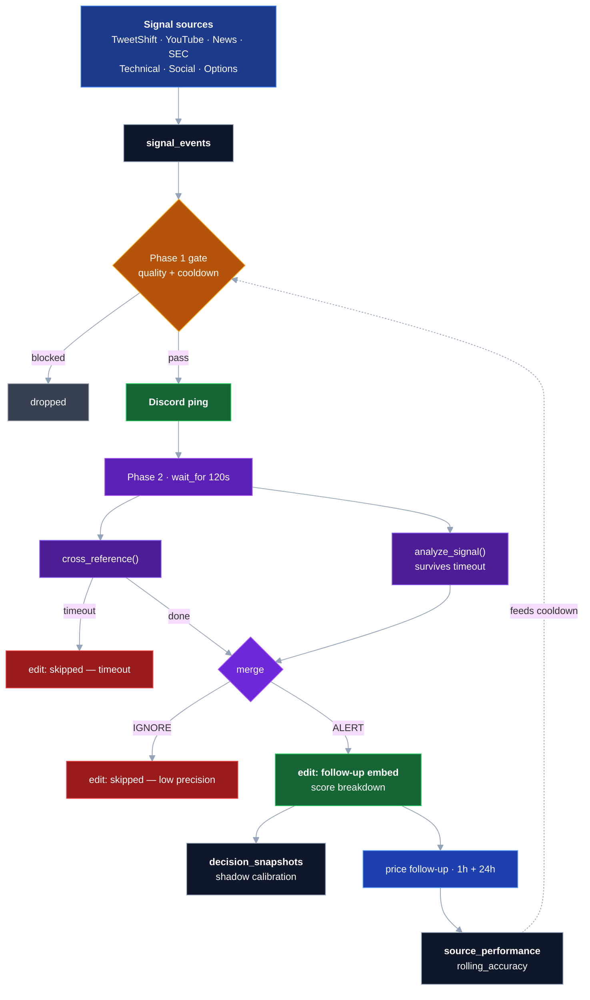

# OpenClaw — Signal-First Stock Alert Engine

A Python pipeline that turns analyst tweets, YouTube transcripts, news, SEC filings, options flow, and social chatter into actionable Discord alerts. The thesis is **signal first, context second**: tweet → instant ping in Discord → asynchronous cross-reference + score breakdown in a follow-up reply. No quality gate blocks the Phase-1 ping.

## Architecture

Signals are ingested from independent scanners into a single `signal_events` table (idempotent, normalized). Each ingestion triggers a two-phase alert — Phase 1 ships an instant Discord ping within seconds; Phase 2 runs cross-reference + precision-engine in parallel and edits the Phase-1 message with the score breakdown (or an explicit skip reason on timeout).



Calibration is logged in shadow mode: predictions go into `decision_snapshots.feature_vector_json`, the Discord probability field renders `score/100 (uncalibrated)` until a trained model is persisted, and `retrain_enabled` flips true only after `signal_events` saturation passes 80% for 7 days.

Reliability weighting and regime-detector gating are on the roadmap but not wired into the live scoring path.

## Quick Start

Prereqs: Python 3.10+, Docker Compose, Ubuntu 22.04+.

```bash
pip3 install aiohttp aiosqlite pyyaml yfinance feedparser requests beautifulsoup4 playwright playwright-stealth
playwright install chromium && playwright install-deps chromium
```

Create `/root/.openclaw/.env`:

```bash
export FINNHUB_API_KEY=...
export OPENROUTER_API_KEY=...
export DISCORD_BOT_TOKEN=...
export DISCORD_CHANNEL_ID=...              # #alerts
export DISCORD_FEED_CHANNEL_ID=...         # TweetShift mirror channel
export DISCORD_BRIEFING_CHANNEL_ID=...     # Alfred morning digest
export BRAVE_SEARCH_API_KEY=...
export SERPAPI_API_KEY=...

# Optional — override models declared in config/consensus.yaml
export TEXT_MODEL="minimax/minimax-m2.5:free"
export VISION_MODEL="google/gemma-4-31b-it:free"
```

Discord bot needs **Message Content** + **Server Members** intents, the `bot` + `applications.commands` scopes, and Read/Send/History/Embed permissions. Point [TweetShift](https://tweetshift.com) at `DISCORD_FEED_CHANNEL_ID`.

```bash
source /root/.openclaw/.env
python3 -m consensus_engine                   # run the full engine
python3 -m consensus_engine --once            # single poll cycle
python3 -m consensus_engine --dry-run --once  # logs only, no Discord
python3 -m consensus_engine --status          # health report
python3 -m pytest tests/ -v                   # full test suite
docker compose up -d                          # start SearXNG on :8888
```

Optional systemd unit:

```ini
[Unit]
Description=OpenClaw Signal Engine
After=network.target docker.service
[Service]
Type=simple
WorkingDirectory=/root/.openclaw/workspace
ExecStart=/usr/bin/python3 -m consensus_engine
Restart=always
RestartSec=10
Environment=PYTHONUNBUFFERED=1
[Install]
WantedBy=multi-user.target
```

## Signal Sources

| Source | Mechanism | Standalone alerts? |
|---|---|---|
| **TweetShift** | Discord Gateway listener mirrors analyst tweets. `tweet_parser.py` runs text + vision models via OpenRouter. | Yes — Phase-1 instant ping |
| **YouTube transcripts** | `video_parser.py` extracts tickers, direction, price levels, macro thesis. Quality-gated at min 250 words + symbol disambiguation. Channels managed via `!yt-follow`. | Yes — HIGH-conviction only |
| **News cascade** | 4-tier: Finnhub → Google News RSS → Brave Search → SearXNG. Catalyst tiers: +25 (Earnings/M&A/FDA), +15 (Upgrade/SEC), +8 (Patent/Partnership). | Xref-only |
| **SEC EDGAR** | 8-K, 10-K, 10-Q, Form 4, 13D/G (48 h window). Form 4 adds +15. Standalone alerts disabled by design — SEC is a confirmer, not a trigger. | Xref-only |
| **Technical** | Direction-aware: RVOL, VWAP, RSI, EMA crossover, ATR breakout. +2 each, max +12. | Xref-only |
| **Social** | Reddit JSON API, ApeWisdom, Google Trends. | Xref-only |
| **Options flow** | Unusual vol/OI (>3×, >100 contracts) via yfinance + market-wide sweep scanner. | Xref-only |
| **Volume breakout** | RVOL >5× + price change >1% during market hours. | Proactive — scanner loop |
| **Earnings calendar** | Day-before pre-alert for tracked tickers via Finnhub. | Proactive — scanner loop |
| **Vault / Atlas / Alfred** | Research memory (Vault) + nightly sweep (Atlas) + morning digest (Alfred) posted to the briefing channel. | Briefing-only |

### Background loops

| Loop | Frequency |
|---|---|
| Social scanner | 5 min — Reddit, ApeWisdom, Google Trends |
| Price follow-up tracker | 1 h + 24 h per alert — feeds `source_performance` |
| Signal pruner | 15 min — expires stale signals after 2 h |
| YouTube scanner | Polls each followed channel's RSS; new videos parse automatically |
| Reddit trend digest | 4 h |
| Macro digest | Weekdays 06:00 ET — YouTube macro direction summary |
| Level proximity alerter | Per poll cycle — fires when price is within `youtube.level_alert_proximity_pct` of a flagged level |
| Atlas nightly sweep | Overnight — summarises the research vault |
| Alfred morning briefing | Weekdays pre-open — posts digest to briefing channel |

## Configuration

Everything lives in `config/consensus.yaml`. API keys resolve from `$ENV_VAR` at load time.

| Section | Controls |
|---|---|
| `api_keys` | Secrets (`$ENV_VAR` refs) |
| `llm` | `text_model`, `vision_model`, `min_confidence`, `max_tokens` |
| `scoring` | Base score, source multipliers, catalyst tiers |
| `news_cascade` | Tier order, Finnhub lookback, Brave daily budget |
| `intervals` | `social_scan` (5 m), `reddit_trend` (4 h), `prune` (15 m), `cross_reference_timeout` (120 s) |
| `social` | Subreddit list, ApeWisdom / Trends toggles |
| `technical` | RVOL threshold, RSI bounds, EMA periods, ATR |
| `ticker_validation` | Min market cap, cache TTL |
| `scanners` | Per-scanner enable toggles |
| `alerts` | `cooldown_hours`, `per_analyst_cooldown.*`, embed colors, min score |
| `calibration` | `shadow_mode.enabled`, `retrain_enabled` |
| `precision_engine.thresholds` | `require_market_confirmation_for_low_conviction`, `high_conviction_threshold`, `sec_catalyst_exempt` |
| `database` | SQLite path, signal TTL (2 h), history retention |
| `freshness_max_age` | Per-source staleness caps (market 60 s, options 30 m, news 90 m, X 4 h, YouTube 24 h) |
| `youtube` | `standalone_alerts`, `min_trust`, `macro_digest_utc_hour`, `level_alert_proximity_pct` |

## Discord Commands

**General** — `!help` · `!status` · `!performance` (win rates, avg P&L, top/worst alerts at 1 h and 24 h)

**On-demand scans** — `!scan <T>` · `!news <T>` · `!sec <T>` · `!options <T>` · `!technical <T> [long|short]` · `!google-trends <T>` · `!market-view <T>` (probabilistic verdict: direction, P(up/down/flat), calibrated confidence, contradiction index) · `!levels <T>`

**Ticker intel** — `!signals <T>` (active signal counts by source) · `!analysts <T>` (analysts in last hour) · `!active-tickers` · `!alert-history <T>` (entry price + 1 h/24 h P&L)

**Market scanners** — `!trend` (Reddit digest on-demand) · `!apewisdom` · `!leaderboard` (per-analyst win rates)

**YouTube intel** — `!yt <URL>` · `!yt-follow <@handle|URL>` · `!yt-mentions <T>` · `!macro` · `!transcript <URL>`

**Engine health** — `!source-health` (live heartbeat / error rate / freshness dashboard with color-coded degradation)

## Scoring

| Source | Points |
|---|---|
| Base conviction | 20 / 25 / 30 |
| Additional analyst | +20 each, max 3 |
| News — high tier | +25 |
| News — medium tier | +15 |
| News — low tier | +8 |
| SEC filing (recent) | +15 |
| ApeWisdom mentions | +10 |
| Reddit mentions (≥2) | +10 |
| Options flow (unusual) | +10 |
| Technical filters | +2 each, max +12 |
| Google Trends spike | +5 |
| LLM confidence boost | up to +15 |

Actionable alerts usually land between 35 and 80+. Quality gate drops signals with base score below 20.

## Project Layout

```
consensus_engine/
  main.py              # orchestrator: loops + tweet processing
  cross_reference.py   # parallel xref aggregator
  engine.py            # precision engine + budget SQL
  db.py                # SQLite schema, queries, signal_events, source_performance
  models.py            # dataclasses
  config.py            # YAML loader with $ENV_VAR resolution
  alerts/              # discord.py (two-phase delivery) + commands.py
  analysis/            # tweet_parser, video_parser, technical, calibration, llm_scorer, indicators
  scanners/            # discord_tweetshift, youtube, news, social, options, sec_*, volume_scanner, earnings_calendar, searxng, reddit_trend
  research/            # Vault (research memory) + Atlas (nightly sweep)
  briefing/            # Alfred (morning digest)
  utils/               # http, rate_limiter, tickers, transcript_fetch, xref_cache, browser

config/
  consensus.yaml       # main config
  searxng/settings.yml # SearXNG Docker config

scripts/               # backtest + ops helpers
tests/                 # 63 test files, 518 tests
sources.json           # analyst handles + followed YouTube channels
```

## Testing

```bash
python3 -m pytest tests/ -v
```

518 tests cover the signal pipeline, precision engine, per-analyst cooldown, Phase-2 timeout (including precision-survival during xref cancellation), calibration shadow mode, signal-event tweet routing, YouTube parser (direction normalization, finish_reason retry, chunk voting), Discord embeds, every command, source health, degraded-mode policy, technical filters, Reddit, options, SEC, TweetShift, and price follow-up.

## Self-Hosted Services

| Service | Port | Purpose |
|---|---|---|
| SearXNG | 8888 | Meta search (Tier 4 news fallback) |

## Changelog

**2026-04-24 — Top-3 precision PR** (`signal-engine-top3-pr`)
Phase-2 timeout + signal-events tweet routing + per-analyst cooldown + calibration shadow mode + honesty label + atomic config rename + four KILL actions. Fixes a 78.4% Phase-2 silent-drop rate by wrapping only `xref_task` in `asyncio.wait_for` (precision engine is untouched). `insert_signal(SourceType.TWITTER)` now writes to `signal_events`, unblocking xref visibility. `check_alert_cooldown()` reads `source_performance.rolling_accuracy` — the blanket 6 h is gone. Discord `P(up 1h)` field renders `score/100 (uncalibrated)` until a calibration model is trained. New flags: `calibration.shadow_mode.enabled`, `calibration.retrain_enabled`, `alerts.per_analyst_cooldown.{enabled,floor_minutes,high_conviction_bypass}`, `precision_engine.thresholds.{high_conviction_threshold,sec_catalyst_exempt}`. Renamed atomically with no shim: `require_market_confirmation` → `require_market_confirmation_for_low_conviction`. Deleted: `alerts.max_alerts_per_hour`, `alerts.reliability_engine_enabled`, `regime_detector:` config stanza. Full design + 13 acceptance criteria: `.omc/plans/2026-04-24-top3-combined-pr-plan.md`.

**2026-04-22 — Vault + Atlas + Alfred**
Research memory, nightly sweep, morning briefing wired into the live loop and enabled in production.

**2026-04-13 — FinalYTplan phases A–D**
Source-reliability weighting, calibration, source-health dashboard, degraded-mode policy, backtest script.

**2026-04 — YouTube intelligence**
Channel registry (`youtube_channels` + `!yt-follow`), `youtube_macro` table + macro digest loop, standalone HIGH-conviction alerts, level-proximity alerter. Precision engine promoted to decision-maker; cross-reference stays as enrichment.

**2026-03 — Multimodal tweet parsing**
Text + vision routing via OpenRouter (`TEXT_MODEL` / `VISION_MODEL`).
